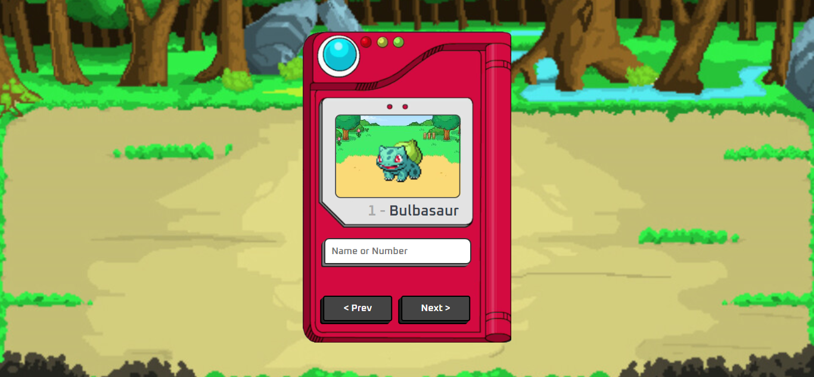

# Projeto Pokedex

## 💻 _pokedex_

Fácil visualição de pokemons.

## 💻 Projeto desenvolvido

<a href="https://gabrieldiasdev.github.io/pokedex/" target="_blank">Acesse o projeto</a>

## 💡 Info

O projeto contém uma interface moderna e responsiva para apresentar pokemons por meio de uma api pública ! <a href="https://pokeapi.co/" target="_blank">Link da api</a>

## 💻 Tecnologias/Pacotes utilizados

**Frontend**

-   HTML
-   CSS
-   Javascript
-   PokeAPI

## 👨‍💻 Autor

Gabriel Dias Catarin, desenvolvedor web | Bauru, São Paulo

[ LinkedIn](https://www.linkedin.com/in/gabriel-dias-260857207/)
&nbsp;
